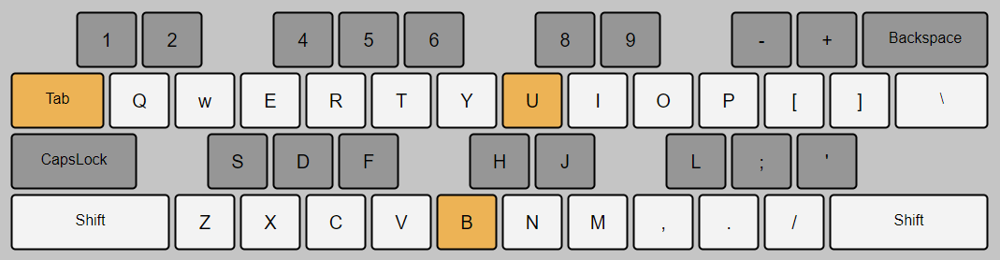

# Web piano
A piano player that runs using Tone.js with just keyboard. See keyboard [layout](keyboard-layout.png) below

[Try it out](https://custap80.github.io/instr)

## Instruments
- `Piano`: Steinway D soft, `~3MB` Total size
- `Square tone`: Plain square wave
- `Flute`: Filtered square wave
- `Flute2`: Same as Flute, with detune

## Development
To use this locally. It needs to run from host server, not to open HTML directly (otherwise it would cause CORS issue).
- Clone this repo
- Run `simple-server.bat`
- Open URL `localhost:8000` or `127.0.0.1:8000` on the browser.

## Workaround
Mainly developed for chrome-based browser. There are small problems on firefox.
- Right and left `shift` keycode are not captured in firefox. Try [this](https://www.toptal.com/developers/keycode) if it does
- Delayed `setTimeout` and `setInterval` on firefox. There's obvious difference on `flute.html`

## References
- [Tone.js](https://github.com/Tonejs/Tone.js)
- [Simple Server](https://github.com/TheWaWaR/simple-http-server)
